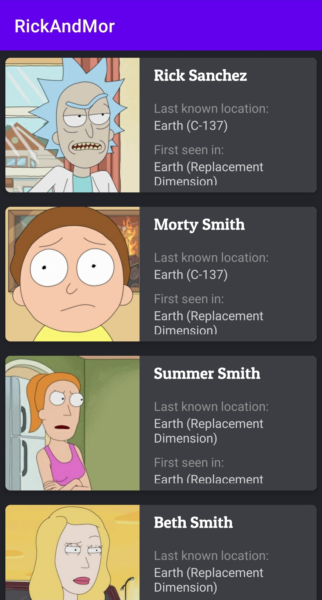

## Portofolio

| Project                                                                                                                                                                                                                                                                                                                                                                                                                                                                                                                                |                                                                           |
| :------------------------------------------------------------------------------------------------------------------------------------------------------------------------------------------------------------------------------------------------------------------------------------------------------------------------------------------------------------------------------------------------------------------------------------------------------------------------------------------------------------------------------------- | ------------------------------------------------------------------------- |
|   <strong>Subar</strong> (Surat Kabar)     A sample news app that has some features such as list article, favorite, and daily notification everyday at 7 am.   • Modular architecture  • Clean Architecture (seperate 3 layer : presentation, domain, data)  • **CoroutineFlow** for reactive programming • **Koin** for dependecy injection  • **Retrofit** to fetching data from network  • **Room** for local data  • Alarm Manager   **[See more](https://github.com/aransafp/Subar/)**  |       |
|                                                                                                                                                                                                                                                                                                                                                                                                                                                                                                                                        |                                                                           |
|   <strong>RickAndMor</strong>     An app that shows list of character in rick and morty film. This app build to demonstrate the implement of MVI (Model-View-Intent) pattern.    • MVI (Model-View-Intent) pattern  • Repository  • Retrofit, Gson, OkHttp Logging Interceptor • Kotlin Coroutine  • Kotlin Flow   **[See more](https://github.com/aransafp/RickAndMor)**                                                                  |  |
|                                                                                                                                                                                                                                                                                                                                                                                                                                                                                                                                        |                                                                           |
|   <strong>Muvi</strong>     A sample movie app that demonstrate the implement of android architecture component.    • MVVM (Model-View-ViewModel) pattern   • ViewModel & LiveData  • Repository  • Fetching data using Retrofit • Local data with Room  • Paging 2 • Manual dependecy injection • Unit Testing  • Instrumentation Testing   **[See more](https://github.com/aransafp/muvi/)**  **[Download App](https://drive.google.com/file/d/1ETpRHHXdGM30t4LOZBSXEClGNtYRUHaG/view?usp=sharing)**                         |        |
