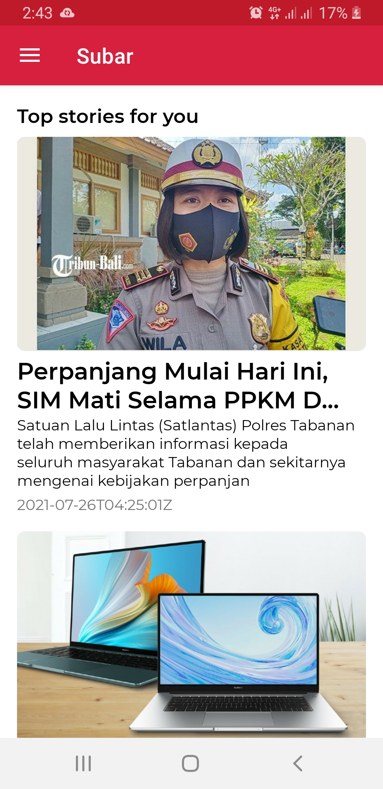
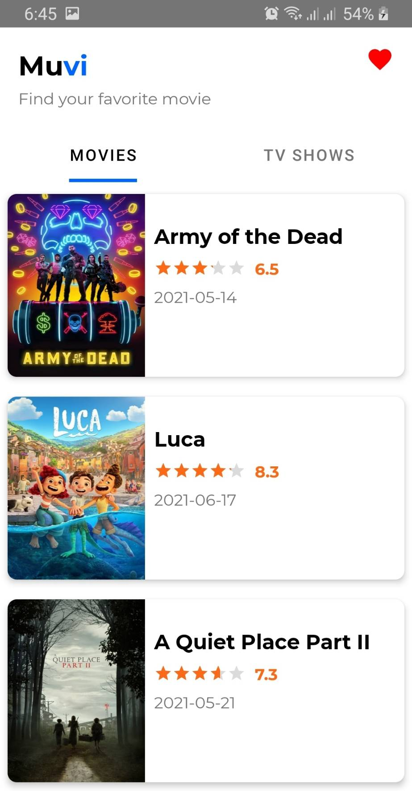

Portofolio
------------

| Project | |
|:-----|---------|
|  <strong>Subar</strong>      **Subar** (Surat Kabar) is A sample news app that implement clean architecture   • Modular architecture  • Clean Architecture (seperate 3 layer : presentation, domain, data)  • Reactive Programming using **CoroutineFlow**  • Dependency Injection using **Koin** • Fetching data using Retrofit • Local data with Room   **[Browse](https://github.com/aransafp/Subar/)**  |  |
|  |  |
|  <strong>Muvi</strong>      A sample movie app that demonstrate the implement of android architecture component    • ViewModel & LiveData  • Repository  • Fetching data using Retrofit • Local data with Room  • Paging 2 • Manual dependecy injection • Unit Testing  • Instrumentation Testing   **[Browse](https://github.com/aransafp/muvi/)**  **[Download App](https://drive.google.com/file/d/1ETpRHHXdGM30t4LOZBSXEClGNtYRUHaG/view?usp=sharing)**  |  |